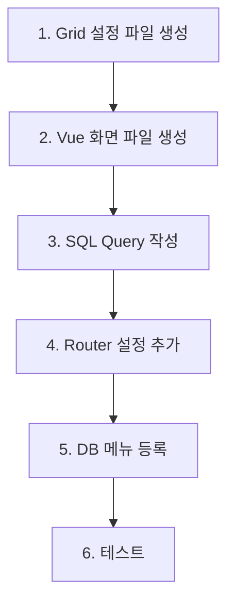

# 📋 dwisCOST 화면 생성 프로세스 가이드

> **작성일**: 2025-11-11  
> **버전**: 1.0  
> **목적**: 신규 화면 개발 시 표준 프로세스 및 체크리스트 제공

---

## 📑 목차

1. [화면 생성 프로세스](#1-화면-생성-프로세스)
2. [파일 생성 체크리스트](#2-파일-생성-체크리스트)
3. [화면 확인 및 테스트](#3-화면-확인-및-테스트)
4. [자주 발생하는 에러 및 해결방법](#4-자주-발생하는-에러-및-해결방법)
5. [코딩 컨벤션](#5-코딩-컨벤션)
6. [예제: C0003008 매출원가 화면](#6-예제-c0003008-매출원가-화면)

---

## 1. 화면 생성 프로세스

### 1.1 사전 준비

#### ✅ 메뉴 번호 확인
```bash
# 1. 기존 메뉴 구조 확인
ls -la src/main/vue/src/views/web/c0003000/

# 2. 사용 가능한 메뉴 번호 파악
# 예: C0003001, C0003002, C0003003, C0003005, C0003007, C0003009, C0003010
# → C0003004, C0003006, C0003008 사용 가능
```

#### ✅ 요구사항 정의
- [ ] 화면 목적 명확화
- [ ] 조회 조건 정의
- [ ] 그리드 컬럼 구조 설계
- [ ] 데이터 소스 테이블 확인
- [ ] 계산 로직 정의 (있는 경우)

---

### 1.2 파일 생성 순서



#### **Step 1: Grid 설정 파일 생성**
```javascript
// 파일 위치: src/main/vue/src/views/web/c0003000/js/C0003XXX.js

const { ValueType } = require('realgrid');

const grid = {
  options: {
    checkBar: { visible: false },
    copy: { enabled: true, singleMode: true },
    display: { 
      columnMovable: false, 
      editItemMerging: true, 
      fitStyle: 'even', 
      emptyMessage: '조회된 데이터가 없습니다.', 
      hscrollBar: true, 
      showEmptyMessage: true 
    },
    edit: { editable: false },
    footer: { visible: true },
    paste: { enabled: false },
    rowIndicator: { visible: true },
    sorting: { enabled: true },
    stateBar: { visible: false },
    filtering: { enabled: true },
    fixed: { colBarWidth: 0, colCount: 0 },
  },

  fields: [
    { fieldName: 'column1', dataType: ValueType.TEXT },
    { fieldName: 'column2', dataType: ValueType.NUMBER },
    // ... 필드 정의
  ],

  columns: [
    { 
      name: 'column1', 
      fieldName: 'column1', 
      width: '100', 
      header: { text: '컬럼1' }, 
      autoFilter: true, 
      styleName: 'tl' 
    },
    { 
      name: 'column2', 
      fieldName: 'column2', 
      width: '120', 
      header: { text: '컬럼2' }, 
      autoFilter: true, 
      styleName: 'tr', 
      numberFormat: '#,##0', 
      footer: { 
        expression: 'sum', 
        numberFormat: '#,##0', 
        styleName: 'sum-footer1' 
      } 
    },
    // ... 컬럼 정의
  ],
};

module.exports = grid;
```

**주요 설정 옵션:**
- `styleName: 'tl'` - 왼쪽 정렬 (텍스트)
- `styleName: 'tr'` - 오른쪽 정렬 (숫자)
- `styleName: 'tc'` - 가운데 정렬
- `numberFormat: '#,##0'` - 천단위 콤마
- `numberFormat: '#,##0.00'` - 소수점 2자리
- `footer: { expression: 'sum' }` - 합계 표시

---

#### **Step 2: Vue 화면 파일 생성**
```vue
// 파일 위치: src/main/vue/src/views/web/c0003000/C0003XXX.vue

/**
 * 메뉴명 > 화면명
 */
<template>
  <div>
    <!-- 검색 영역 -->
    <div class="search_box">
      <b-row class="search_area">
        <!-- 기준월 -->
        <b-col cols="1" class="period">
          <div class="form-floating me-1">
            <date-picker label="기준월" mode="month" v-model="params.yyyymm" />
            <label for="floatingSelect" class="select">기준월</label>
          </div>
        </b-col>
        
        <!-- 사업장 -->
        <b-col cols="2" class="ms-3">
          <div class="form-floating">
            <input autocomplete="off" type="text" class="form-control label-60" 
                   id="floating" placeholder="Site" v-model="params.site" :disabled="true" />
            <label for="floating">사업장</label>
          </div>
        </b-col>
        
        <!-- 셀렉트박스 예제 -->
        <b-col cols="2">
          <div class="form-floating">
            <select class="form-select label-60" id="floatingSelect" v-model="params.gubun">
              <option v-for="gubun in gubunList" :key="gubun.value" :value="gubun">
                {{ gubun.text }}
              </option>
            </select>
            <label for="floatingSelect" class="select">구분</label>
          </div>
        </b-col>
      </b-row>
      
      <!-- 버튼 영역 -->
      <div class="btn_area">
        <b-button @click="searchClick"><span class="ico_search"></span>조회</b-button>
      </div>
    </div>
    
    <!-- 그리드 영역 -->
    <div class="grid_box search_onerow">
      <div class="left_box">
        <div class="btn_wrap ms-auto">
          <b-button class="second" @click="excelBtnClick">엑셀</b-button>
        </div>
      </div>
      <div class="grid-border-none">
        <RealGrid ref="dataGrid" :uid="'dataGrid'" :step="'1'" 
                  :rows="dataGridRows" style="height: 100%" />
      </div>
    </div>
  </div>
</template>

<script>
import { useUserAuthInfo } from '@store/auth/userAuthInfo';
import { useC0001001 } from '@web/store/C0001001.js';
import gridField from '@web/c0003000/js/C0003XXX.js';

export default {
  props: {},
  components: {},
  setup() {
    const srchInfo = useC0001001();
    const userAuthInfo = useUserAuthInfo();
    return { srchInfo, userAuthInfo };
  },
  data() {
    return {
      dataGrid: null,
      dataGridRows: [],
      params: {
        yyyymm: null,
        site: 'HQ',
        gubun: { value: '전체', text: '전체' },
      },
      gubunList: [
        { value: '전체', text: '전체' },
        { value: '개발', text: '개발' },
        { value: '양산', text: '양산' },
      ],
      siteMap: {
        본사: 'HQ',
        VINA: 'VN',
        HQ: 'HQ',
        VN: 'VN',
      },
    };
  },
  computed: {
    gridView() {
      return this.$refs.dataGrid && this.$refs.dataGrid.getGridView();
    },
    gridDataProvider() {
      return this.$refs.dataGrid && this.$refs.dataGrid.getGridDataProvider();
    },
    prodCtg() {
      return this.userAuthInfo.curProdCtg;
    },
  },
  watch: {
    'params.yyyymm': function(newVal) {
      if (newVal) this.onDateChange();
    },
    'srchInfo.yyyymm': {
      handler(newVal) {
        if (newVal) this.params.yyyymm = newVal;
      }
    },
    prodCtg: {
      handler(newVal) {
        if (newVal) {
          this.params.site = newVal === 'VN' ? 'VINA' : '본사';
          if (this.$refs.dataGrid != null) {
            this.searchClick();
          }
        }
      },
    },
  },
  created() {
    this.initializeGrid();
  },
  mounted() {
    this.params.yyyymm = this.srchInfo.yyyymm;
    this.params.site = this.userAuthInfo.curProdCtg === 'VN' ? 'VINA' : '본사';
    this.$nextTick(() => {
      this.searchClick();
    });
  },
  methods: {
    initializeGrid() {
      this.dataGrid = _.cloneDeep(gridField);
    },
    onDateChange() {
      this.srchInfo.setSearchInfo({ yyyymm: this.params.yyyymm });
    },
    async getDataList() {
      if (!this.gridView) return;
      this.gridView.commit();

      let params = {
        yyyymm: this.params.yyyymm != null ? this.params.yyyymm.replaceAll('-', '') : null,
        site: this.siteMap[this.params.site],
        gubun: this.params.gubun?.value || '전체',
      };

      let param = {
        menuId: 'c0003000',
        queryId: 'C0003XXX_Sch1',
        queryParams: params,
        target: this.dataGridRows,
      };
      
      await this.$axios.api.search(param);
    },
    searchClick() {
      if (!this.params.yyyymm) {
        this.$toast && this.$toast('error', '기준월을 선택해주세요.');
        return;
      }
      this.getDataList();
    },
    async excelBtnClick() {
      const grid = this.gridView;
      const now = new Date();
      const yyyymmdd = this.$utils.getTodayDate();
      const hours = String(now.getHours()).padStart(2, '0');
      const minutes = String(now.getMinutes()).padStart(2, '0');
      const seconds = String(now.getSeconds()).padStart(2, '0');
      const fileName = `화면명_${yyyymmdd}_${hours}${minutes}${seconds}.xlsx`;

      const options = {
        type: 'excel',
        target: 'local',
        fileName: fileName,
        progressMessage: '엑셀 Export중입니다.',
        done: function () {
          alert('엑셀 내보내기가 완료되었습니다!');
        },
      };

      grid.exportGrid(options);
    },
  },
};
</script>
```

---

#### **Step 3: SQL Query 작성**
```xml
<!-- 파일 위치: src/main/resources/mapper/web/c0003000/C0003000.xml -->

<select id="C0003XXX_Sch1" resultType="CamelMap">
    SELECT
        YYYYMM,
        CASE WHEN SITE='HQ' THEN '본사' WHEN SITE='VN' THEN 'VINA' ELSE SITE END AS SITE,
        COLUMN1,
        COLUMN2,
        COLUMN3
    FROM TABLE_NAME
    WHERE 1=1
        AND SEL_CODE = 'ACTUAL'
    <if test="yyyymm != null and yyyymm != ''">
        AND YYYYMM = #{yyyymm}
    </if>
    <if test="site != null and site != ''">
        AND SITE = #{site}
    </if>
    <if test="gubun != null and gubun != '' and gubun != '전체'">
        AND 구분 = #{gubun}
    </if>
    ORDER BY YYYYMM, SITE, COLUMN1
</select>
```

**SQL 작성 팁:**
- `resultType="CamelMap"` 사용 (자동으로 camelCase 변환)
- `<if test="">` 조건문으로 동적 쿼리 작성
- SITE 컬럼은 화면 표시용으로 변환 (HQ→본사, VN→VINA)
- ORDER BY로 정렬 순서 명시

---

#### **Step 4: Router 설정 추가**
```javascript
// 파일 위치: src/main/vue/src/router/c0003000Router.js

{
  path: '/c0003xxx',
  name: '화면명',
  component: () => import('../views/web/c0003000/C0003XXX.vue'),
  meta: {
    upperSysResourceId: 'C0003000',
    sysResourceId: "C0003XXX",
    requiresAuth: true,
  }
}
```

**라우터 설정 주의사항:**
- `path`는 소문자로 통일 (예: `/c0003008`)
- `name`은 한글 메뉴명
- `upperSysResourceId`는 상위 메뉴 ID
- `sysResourceId`는 현재 메뉴 ID
- `requiresAuth: true`는 필수 (로그인 필요)

---

#### **Step 5: DB 메뉴 등록**
```sql
-- 메뉴 테이블에 등록 (실제 테이블명은 프로젝트에 따라 다름)
INSERT INTO SYS_MENU (
    MENU_ID,
    MENU_NAME,
    PARENT_MENU_ID,
    URL,
    SORT_ORDER,
    USE_YN,
    REG_DATE
) VALUES (
    'C0003XXX',
    '화면명',
    'C0003000',
    '/c0003xxx',
    80,
    'Y',
    GETDATE()
);

-- 권한 설정 (필요시)
INSERT INTO SYS_MENU_AUTH (
    MENU_ID,
    USER_ID,
    READ_YN,
    WRITE_YN
) VALUES (
    'C0003XXX',
    'admin',
    'Y',
    'Y'
);
```

---

## 2. 파일 생성 체크리스트

### ✅ 필수 파일 목록

- [ ] **Grid 설정 파일**: `src/main/vue/src/views/web/c0003000/js/C0003XXX.js`
  - [ ] fields 정의 완료
  - [ ] columns 정의 완료
  - [ ] numberFormat 설정 (숫자 컬럼)
  - [ ] footer 합계 설정 (필요시)

- [ ] **Vue 화면 파일**: `src/main/vue/src/views/web/c0003000/C0003XXX.vue`
  - [ ] template 작성 완료
  - [ ] script 작성 완료
  - [ ] gridField import 경로 확인
  - [ ] 조회 조건 validation 추가

- [ ] **SQL Query**: `src/main/resources/mapper/web/c0003000/C0003000.xml`
  - [ ] select id 명명 규칙 준수 (C0003XXX_Sch1)
  - [ ] resultType="CamelMap" 설정
  - [ ] 동적 쿼리 조건 추가
  - [ ] ORDER BY 절 추가

- [ ] **Router 설정**: `src/main/vue/src/router/c0003000Router.js`
  - [ ] path 소문자로 설정
  - [ ] name 한글명 설정
  - [ ] meta 정보 완료
  - [ ] import 경로 확인

- [ ] **DB 메뉴 등록**
  - [ ] 메뉴 정보 INSERT
  - [ ] 권한 설정 완료
  - [ ] 정렬 순서 설정

---

## 3. 화면 확인 및 테스트

### 3.1 개발 서버 실행

```bash
# Backend (Spring Boot)
cd /home/roarm_m3/dwisCOST
mvn spring-boot:run

# Frontend (Vue.js) - 새 터미널
cd /home/roarm_m3/dwisCOST/src/main/vue
npm run serve
```

### 3.2 화면 접근 테스트

#### ✅ URL 직접 접근
```
http://localhost:8080/#/c0003xxx
```

#### ✅ 메뉴를 통한 접근
1. 로그인
2. 메뉴에서 "제조매출원가" > "화면명" 클릭
3. 화면 로딩 확인

### 3.3 기능 테스트 체크리스트

#### **화면 로딩 테스트**
- [ ] 화면이 정상적으로 로딩되는가?
- [ ] Console 에러 없는가?
- [ ] 기본값이 설정되어 있는가?
  - [ ] 기준월: 현재 월
  - [ ] 사업장: 사용자 권한에 따라 자동 설정

#### **조회 기능 테스트**
- [ ] 조건 없이 조회 시 validation 동작하는가?
- [ ] 기준월 선택 후 조회 시 데이터가 표시되는가?
- [ ] 사업장 변경 시 자동 재조회되는가?
- [ ] 구분 변경 시 데이터가 필터링되는가?
- [ ] "조회된 데이터가 없습니다" 메시지 표시되는가? (데이터 없을 때)

#### **그리드 기능 테스트**
- [ ] 컬럼 정렬 기능 동작하는가?
- [ ] 필터 기능 동작하는가?
- [ ] 숫자 포맷(천단위 콤마) 정상 표시되는가?
- [ ] Footer 합계가 정확한가?
- [ ] 가로 스크롤 동작하는가? (컬럼 많을 때)

#### **엑셀 다운로드 테스트**
- [ ] 엑셀 버튼 클릭 시 파일이 다운로드되는가?
- [ ] 파일명 형식이 올바른가? (화면명_YYYYMMDD_HHMMSS.xlsx)
- [ ] 다운로드된 파일의 데이터가 정확한가?
- [ ] 숫자 포맷이 유지되는가?

#### **반응형 테스트**
- [ ] 사업장 변경 시 자동 재조회되는가?
- [ ] 기준월 변경 시 store에 저장되는가?
- [ ] 다른 화면 갔다가 돌아와도 조회 조건 유지되는가?

---

## 4. 자주 발생하는 에러 및 해결방법

### 4.1 Frontend 에러

#### ❌ **에러 1: Cannot read property 'getGridView' of undefined**
```
TypeError: Cannot read property 'getGridView' of undefined
    at VueComponent.gridView (C0003008.vue:123)
```

**원인**: ref가 아직 생성되지 않음

**해결방법**:
```javascript
// ❌ 잘못된 코드
computed: {
  gridView() {
    return this.$refs.dataGrid.getGridView();  // ref가 없으면 에러
  }
}

// ✅ 올바른 코드
computed: {
  gridView() {
    return this.$refs.dataGrid && this.$refs.dataGrid.getGridView();
  }
}
```

---

#### ❌ **에러 2: Module not found: Error: Can't resolve '../js/C0003XXX.js'**
```
Module not found: Error: Can't resolve '@web/c0003000/js/C0003008.js'
```

**원인**: Grid 설정 파일 경로 오류

**해결방법**:
1. 파일 존재 여부 확인
```bash
ls -la src/main/vue/src/views/web/c0003000/js/C0003008.js
```

2. import 경로 확인
```javascript
// ✅ 올바른 경로
import gridField from '@web/c0003000/js/C0003008.js';
```

---

#### ❌ **에러 3: [Vue warn]: Invalid prop: type check failed for prop "rows"**
```
[Vue warn]: Invalid prop: type check failed for prop "rows". 
Expected Array, got Undefined
```

**원인**: dataGridRows가 초기화되지 않음

**해결방법**:
```javascript
data() {
  return {
    dataGrid: null,
    dataGridRows: [],  // ✅ 반드시 빈 배열로 초기화
    params: { ... }
  };
}
```

---

#### ❌ **에러 4: Cannot read property 'replaceAll' of null**
```
TypeError: Cannot read property 'replaceAll' of null
```

**원인**: params.yyyymm이 null인 상태에서 replaceAll 호출

**해결방법**:
```javascript
// ❌ 잘못된 코드
let params = {
  yyyymm: this.params.yyyymm.replaceAll('-', ''),
};

// ✅ 올바른 코드
let params = {
  yyyymm: this.params.yyyymm != null ? this.params.yyyymm.replaceAll('-', '') : null,
};
```

---

#### ❌ **에러 5: [Vue warn]: Property "props" was accessed during render**
```
[Vue warn]: Property "props" was accessed during render but is not defined on instance.
[Vue warn]: Avoid app logic that relies on enumerating keys on a component instance.
```

**원인**: Vue 컴포넌트에서 빈 `props: {}` 또는 빈 `components: {}` 선언

**해결방법**: 불필요한 빈 객체 선언 제거
```javascript
// ❌ 잘못된 코드
export default {
  props: {},        // 빈 객체 선언하지 말 것
  components: {},   // 빈 객체 선언하지 말 것
  setup() { ... }
}

// ✅ 올바른 코드 (필요 없으면 아예 제거)
export default {
  name: 'C0003008',  // 컴포넌트 이름 추가 권장
  setup() { ... }
}

// ✅ 또는 실제로 사용하는 경우만 선언
export default {
  name: 'C0003008',
  props: {
    userId: String,   // 실제 사용하는 prop만 선언
  },
  components: {
    CustomComponent,  // 실제 사용하는 컴포넌트만 선언
  },
  setup() { ... }
}
```

---

#### ❌ **에러 6: Parsing error: No Babel config file detected**
```
Parsing error: No Babel config file detected for /home/.../C0003008.js
```

**원인**: ESLint/Babel 설정 문제 (개발에는 영향 없음)

**해결방법**: 무시해도 됨. 또는 `.eslintrc.js` 설정 추가
```javascript
// .eslintrc.js
module.exports = {
  parserOptions: {
    requireConfigFile: false
  }
};
```

---

#### ❌ **에러 7: Cannot read properties of undefined (reading 'data')**
```
axios.js:139 데이터를 가져오는 중 오류 발생: 
TypeError: Cannot read properties of undefined (reading 'data')
    at axios.js:127:96
    at async Object.search (axios.js:127:20)
```

**원인**: 백엔드 서버가 실행되지 않았거나 API 호출이 실패함

**해결방법**:

1. **백엔드 서버 실행 확인**
```bash
# 서버 프로세스 확인
ps aux | grep -E "mvnw|spring-boot" | grep -v grep

# 포트 9090 확인
netstat -tlnp | grep :9090
# 또는
ss -tlnp | grep :9090
```

2. **서버가 실행되지 않은 경우 시작**
```bash
cd /home/roarm_m3/dwisCOST
nohup ./mvnw spring-boot:run > logs/backend.log 2>&1 &
```

3. **서버 로그 확인**
```bash
tail -f logs/backend.log
```

4. **API 응답 확인**
- 브라우저 개발자 도구 > Network 탭에서 API 응답 확인
- Status Code가 200이 아니면 백엔드 로그 확인
- SQL 에러일 경우 쿼리 수정 필요

**예방 조치**:
- axios.js의 search 메서드는 이미 에러 핸들링이 되어 있어 빈 배열 반환
- 하지만 서버가 실행되지 않으면 데이터를 가져올 수 없으므로 서버 상태 먼저 확인 필수!

---

### 4.2 Backend 에러

#### ❌ **에러 8: There is no getter for property named 'yyyymm' in 'class java.lang.String'**
```
org.apache.ibatis.reflection.ReflectionException: 
There is no getter for property named 'yyyymm' in 'class java.lang.String'
```

**원인**: MyBatis parameterType 불일치

**해결방법**:
```xml
<!-- ❌ 잘못된 쿼리 -->
<select id="C0003008_Sch1" parameterType="String" resultType="CamelMap">
    SELECT * FROM TABLE WHERE YYYYMM = #{yyyymm}
</select>

<!-- ✅ 올바른 쿼리 -->
<select id="C0003008_Sch1" resultType="CamelMap">
    <!-- parameterType 생략하면 자동으로 Map으로 인식 -->
    SELECT * FROM TABLE WHERE YYYYMM = #{yyyymm}
</select>
```

---

#### ❌ **에러 9: Invalid column name 'SITE'**
```
com.microsoft.sqlserver.jdbc.SQLServerException: Invalid column name 'SITE'.
```

**원인**: SQL 쿼리에서 존재하지 않는 컬럼 참조

**해결방법**:
1. 테이블 구조 확인
```sql
-- 테이블 컬럼 확인
SELECT * FROM INFORMATION_SCHEMA.COLUMNS 
WHERE TABLE_NAME = 'DOI_STOCK_COST';
```

2. 올바른 컬럼명 사용
```xml
<!-- DW_SITE가 실제 컬럼명이라면 -->
<select id="C0003008_Sch1" resultType="CamelMap">
    SELECT 
        CASE WHEN DW_SITE='HQ' THEN '본사' ELSE DW_SITE END AS SITE
    FROM DOI_STOCK_COST
</select>
```

---

#### ❌ **에러 10: Mapped Statements collection does not contain value for C0003008_Sch1**
```
org.apache.ibatis.binding.BindingException: 
Invalid bound statement (not found): ...C0003000Mapper.C0003008_Sch1
```

**원인**: Mapper XML의 select id를 찾을 수 없음

**해결방법**:
1. select id 확인
```xml
<!-- src/main/resources/mapper/web/c0003000/C0003000.xml -->
<mapper namespace="com.dowinsys.cost.web.c0003000.mapper.C0003000Mapper">
    <select id="C0003008_Sch1" resultType="CamelMap">
        <!-- Query -->
    </select>
</mapper>
```

2. 프로젝트 재빌드
```bash
mvn clean compile
# 또는 IDE에서 Rebuild
```

---

#### ❌ **에러 11: 404 Not Found - /api/c0003000/c0003008**
```
GET http://localhost:8080/api/c0003000/c0003008 404 (Not Found)
```

**원인**: API 엔드포인트가 없음 (조회만 하는 화면은 정상)

**해결방법**: `axios.api.search()` 사용
```javascript
// ❌ 일반 REST API 호출 (Controller 필요)
await this.$axios.post('/api/c0003000/c0003008', params);

// ✅ 공통 조회 API 사용 (Controller 불필요)
let param = {
  menuId: 'c0003000',
  queryId: 'C0003008_Sch1',
  queryParams: params,
  target: this.dataGridRows,
};
await this.$axios.api.search(param);
```

---

### 4.3 데이터 에러

#### ❌ **에러 12: 조회 결과가 비어있음 (데이터는 있는데)**
```
// 쿼리 실행 결과는 있지만 화면에 표시 안됨
```

**원인**: 
1. fieldName과 SQL 컬럼명 불일치
2. target 배열 설정 오류

**해결방법**:
```javascript
// 1. Grid fields와 SQL SELECT 컬럼명 일치 확인
// Grid 설정
fields: [
  { fieldName: 'saleAmt', dataType: ValueType.NUMBER },  // camelCase
]

// SQL (resultType="CamelMap" 사용 시 자동 변환됨)
SELECT 
    sale_amt AS saleAmt,  // 명시적으로 camelCase 지정 (권장)
    -- 또는
    sale_amt  // CamelMap이 자동으로 saleAmt로 변환
FROM TABLE

// 2. target 배열 확인
let param = {
  menuId: 'c0003000',
  queryId: 'C0003008_Sch1',
  queryParams: params,
  target: this.dataGridRows,  // ✅ 올바른 변수명
};
```

---

#### ❌ **에러 13: 합계가 정확하지 않음**
```
// Footer 합계 값이 이상함
```

**원인**: 
1. numberFormat 설정 누락
2. dataType이 TEXT로 되어있음

**해결방법**:
```javascript
// Grid 설정
fields: [
  { fieldName: 'amount', dataType: ValueType.NUMBER },  // ✅ NUMBER 타입
],
columns: [
  { 
    name: 'amount', 
    fieldName: 'amount',
    numberFormat: '#,##0',  // ✅ 포맷 설정
    footer: { 
      expression: 'sum',
      numberFormat: '#,##0',  // ✅ Footer도 포맷 설정
    }
  }
]
```

---

## 5. 코딩 컨벤션

### 5.1 명명 규칙

#### 파일명
- Vue 컴포넌트: `C0003008.vue` (대문자)
- JS 파일: `C0003008.js` (대문자)
- Router: `c0003000Router.js` (소문자 시작 + Router)

#### 변수명
- Grid ref: `dataGrid`, `saleCostGrid` (camelCase)
- Grid rows: `dataGridRows`, `saleCostGridRows`
- params: `params.yyyymm`, `params.site` (소문자)

#### SQL
- Query ID: `C0003008_Sch1` (대문자 + _Sch + 숫자)
- 테이블명: `DOI_STOCK_COST` (대문자 + 언더스코어)
- 컬럼명: `YYYYMM`, `SALE_AMT` (대문자 + 언더스코어)

### 5.2 주석 규칙

```vue
/**
 * 메뉴명 > 화면명
 * @description 화면 설명
 * @created 2025-11-11
 */
<template>
  <!-- 검색 영역 -->
  <div class="search_box">
    ...
  </div>
  
  <!-- 그리드 영역 -->
  <div class="grid_box">
    ...
  </div>
</template>
```

```javascript
// Grid 설정 파일
/*
 * 메뉴명 > 화면명
 */

// 함수 주석
/**
 * 데이터 조회
 * @description 조건에 맞는 데이터를 조회하여 그리드에 표시
 */
async getDataList() {
  ...
}
```

```xml
<!-- SQL Query -->
<!-- C0003008: 매출원가 (모델별/거래선별 매출금액 비율 배부) -->
<select id="C0003008_Sch1" resultType="CamelMap">
    -- 재고금액 CTE
    WITH stco AS (
        ...
    )
    SELECT ...
</select>
```

---

## 6. 예제: C0003008 매출원가 화면

### 6.1 실제 생성 순서

```bash
# 1. Grid 설정 파일 생성
vi src/main/vue/src/views/web/c0003000/js/C0003008.js

# 2. Vue 화면 파일 생성  
vi src/main/vue/src/views/web/c0003000/C0003008.vue

# 3. SQL Query 추가
vi src/main/resources/mapper/web/c0003000/C0003000.xml

# 4. Router 설정 추가
vi src/main/vue/src/router/c0003000Router.js

# 5. 서버 재시작 및 테스트
mvn spring-boot:run
npm run serve
```

### 6.2 테스트 결과

#### ✅ 성공 케이스
```
URL: http://localhost:8080/#/c0003008
기준월: 202507
사업장: 본사
구분: 전체

결과:
- 조회 성공
- 거래처별 매출원가 표시
- 배부율 합계 100% 확인
- 엑셀 다운로드 정상
```

#### ❌ 실패 케이스 (및 해결)
```
에러: "기준월을 선택해주세요"
원인: validation 동작
해결: 기준월 선택 후 조회

에러: 데이터 없음
원인: 202507 데이터 없음
해결: 실제 데이터 있는 월로 조회 (예: 202410)
```

### 6.3 검증 쿼리

```sql
-- 1. 배부율 합계 확인 (같은 모델/구분 그룹별 100% 확인)
SELECT 
    MODEL, 구분, EXPEN_SEL,
    SUM(배부율) as 배부율합계
FROM (
    -- C0003008_Sch1 쿼리 결과
) A
GROUP BY MODEL, 구분, EXPEN_SEL
-- 배부율합계 = 100.00% 이어야 함

-- 2. 매출원가 합계 확인 (출고금액과 일치 확인)
SELECT 
    MODEL, 구분, EXPEN_SEL,
    SUM(매출원가) as 매출원가합계,
    MAX(출고금액) as 출고금액,
    SUM(매출원가) - MAX(출고금액) as 차이
FROM (
    -- C0003008_Sch1 쿼리 결과
) A
GROUP BY MODEL, 구분, EXPEN_SEL
-- 차이 = 0 또는 ±1 (반올림 오차) 이어야 함
```

---

## 7. 체크리스트 템플릿

### 화면 개발 체크리스트

```markdown
## 화면: C0003XXX - 화면명

### 개발 전
- [ ] 메뉴 번호 확정
- [ ] 요구사항 정의
- [ ] 데이터 소스 테이블 확인
- [ ] 그리드 컬럼 설계
- [ ] 계산 로직 정의

### 파일 생성
- [ ] Grid 설정 파일 (js/C0003XXX.js)
- [ ] Vue 화면 파일 (C0003XXX.vue)
- [ ] SQL Query (C0003000.xml)
- [ ] Router 설정 (c0003000Router.js)

### 기능 테스트
- [ ] 화면 로딩
- [ ] 조회 기능
- [ ] 그리드 표시
- [ ] 엑셀 다운로드
- [ ] 반응형 동작

### 데이터 검증
- [ ] 조회 결과 정확성
- [ ] 합계 정확성
- [ ] 계산 로직 검증
- [ ] 예외 케이스 처리

### 배포 준비
- [ ] DB 메뉴 등록
- [ ] 권한 설정
- [ ] 개발 문서 작성
- [ ] 운영 가이드 작성
```

---

## 8. 참고 문서

### 내부 문서
- `docs/dwisCOST_메뉴구조_및_기능명세서.md` - 전체 메뉴 구조
- `docs/C0003008_매출원가_개발완료.md` - 매출원가 화면 개발 상세

### 외부 참고
- Vue.js 3 공식 문서: https://v3.vuejs.org/
- RealGrid 가이드: http://help.realgrid.com/
- MyBatis 문서: https://mybatis.org/mybatis-3/

---

**문서 버전**: 1.0  
**최종 수정일**: 2025-11-11  
**작성자**: Development Team
